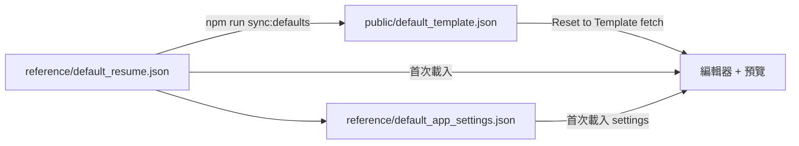

# Creat CV — Premium CV & Resume Engine — 專案規則

**產品名稱**：Creat CV（主標） · Premium CV & Resume Engine（副標）  
**品牌系統**（參考 [Linear Brand](https://linear.app/brand)、SaaS wordmark 研究）：
- **Logomark**：`src/CreatCvLogo.jsx` — 小尺寸／favicon（`public/creat-cv-logo.svg`）
- **Wordmark**：`src/CreatCvWordmark.jsx` + `src/brand/wordmarkPaths.js` — 橫向字標為 **Syne ExtraBold 向量 path**（`npm run wordmark:generate`），非 HTML 文字／非 `<text>` 系統字
- 編輯器內文仍用 Inter；品牌字與 UI 字分離
**操作介面**：以英文為主（編輯器左欄）

本文件為本專案的**約定與操作規則**，供開發者、Cursor Agent 與日後維護參考。請在改動預設資料、Reset 行為或履歷結構前閱讀。

---

## 1. 專案用途

- **左側**：表單編輯（Profile、Work、Skills/Lang、Certs）
- **右側**：A4 即時預覽，40 種 Canva 風格 preset
- **匯出**：Print/PDF（`window.print()`）、Word（`src/docxExporter.js`）
- **設計目標**：PDF 文字可選取、可搜尋（ATS），避免整頁被光柵化成圖片

技術棧：React 19 + Vite 4，`src/main.jsx` 為主入口，`index.css` 為版型與列印樣式。

---

## 2. 單一真相來源（最重要）

| 檔案 | 角色 |
|------|------|
| `reference/default_resume.json` | **啟動與 Reset 用的引導範本**（placeholder 文字，供使用者填寫自己的 CV）。 |
| `reference/default_app_settings.json` | 啟動用 preset、字級、配色等 `settings`。 |
| `public/default_template.json` | 由 `npm run sync:defaults` 從 `reference/` 組裝的 version 2 匯出檔，供瀏覽器 **Reset to Template** 以 `fetch` 載入。 |

### 規則

1. 修改預設範本內容時，應編輯 `reference/default_resume.json` 與 `reference/default_app_settings.json`，再執行 `npm run sync:defaults`。
2. **Reset to Template** 以 `fetch('/default_template.json')` 為依歸；失敗時 fallback 至 bundled `reference` 資料。
3. **Save JSON** 下載 version 2 檔；**Load JSON** 可載入任意合法 JSON，不會自動寫回 canonical。
4. 不再使用個人履歷檔作為專案預設。

---

## 3. Reset、啟動與同步流程



| 操作 | 行為 |
|------|------|
| **首次開啟 / 重新整理** | 載入 `reference/default_resume.json` + `default_app_settings.json`（快速）。 |
| **Reset to Template** | `fetch('/default_template.json')` → 套用完整 `data` + `settings`。 |
| **Save JSON** | 下載 version 2 檔；使用者自行保存。 |
| **Load JSON** | 可載入任意合法 JSON。 |
| **`npm run sync:defaults`** | `reference/` → `public/default_template.json`。 |
| **`npm run dev` / `build`** | 自動執行 `predev` / `prebuild` → `sync:defaults`。 |

若 Reset 時 fetch 失敗（例如未 sync），會 fallback 到 `reference` 備份並提示執行 `npm run sync:defaults`。

---

## 4. JSON 格式（version 2）

```json
{
  "version": 2,
  "data": {
    "personal": { "name", "title", "email", "phone", "address", "links", "photo", "summary" },
    "employment": [{ "id", "company", "role", "period", "bullets", "projects": [{ "id", ... }] }],
    "education": [...],
    "certifications": [{ "id", "name", "issuer", "date", "url" }],
    "skills": [{ "id", "category", "items", "itemsText" }],
    "languages": [{ "id", "name", "level" }],
    "sabbatical": { "enabled", "bullets" }
  },
  "settings": {
    "preset", "paperTexture", "fontSizeRatio", "spacingFactor",
    "photoFrameStyle", "photoScale", "showSkillRatings",
    "colors": { "headerA", "headerB", "accent", "text", "textLight", "bg", "sidebarBg", "langBar", "bannerBg", "bannerText", "skillBg", "skillText" }
  }
}
```

- 舊版僅 `data`、無 `version` 的檔案仍可 **Load JSON** 匯入。
- `normalizeResumeData()`（`src/main.jsx`）會補齊 `id`、`itemsText`、Profile 摘要分行格式。

---

## 5. 內容與編輯器慣例

| 項目 | 規則 |
|------|------|
| **Profile Summary** | 編輯器「每行一點」；與預覽共用 `getProfilePoints()` / `normalizeSummaryStorage()`。 |
| **技能** | 使用 `itemsText` + `onBlur` 提交，避免逗號輸入時游標跳動。 |
| **技能評分** | `skill.itemRatings[]`（1–5，0=不顯示）與 `settings.showSkillRatings`。須在 **Skills / Lang** 為每項技能選評分；預覽**只會**對有評分的技能畫圓點，不再自動造假。 |
| **證照** | 支援 `url`；預覽可點擊；Word 匯出為超連結。 |
| **拖曳排序** | 工作、語言、技能、證照、職責、專案、Sabbatical 等列表可 ⋮⋮ 排序（`useSortableList.jsx`）。 |
| **語言級別** | `Basic` 進度條略低於 `Conversational`（約 48%）。 |
| **照片** | `photoFrameStyle` / `photoScale` 經 `data-photo-frame` 與 CSS 變數生效，避免被 preset `!important` 蓋掉。 |

---

## 6. Template 系統（取代散落的 preset 定義）

- **目錄**：`src/templates/`（見 `src/templates/README.md`）
- **註冊表**：`registry.js` — `registerTemplate()` / `listTemplateOptions()`
- **內建 40 款**：`definitions/builtin/catalog.js`（metadata）+ `themes.generated.js`（配色 token，由 `npm run extract:template-themes` 自 CSS 抽出）
- **執行期**：`resolveTemplate(templateId)` → archetype、layoutFamily、themeCssVars、photoPlacement 等
- **DOM 屬性**：
  - `data-template-id` / `data-preset`（相容舊 CSS）
  - `data-archetype` — 物理版型（`sidebar-right` | `sidebar-left` | `single-column`）
  - `data-layout-family` — 裝飾性 CSS
  - `data-photo-placement` — `header` | `sidebar`（勿再硬編碼 preset id 列表）
- **設定 JSON**：`settings.templateId`（主鍵）；`settings.preset` 為同值別名，相容舊檔
- **新增 template**：只需 `registerTemplate({ id, theme, archetype, ... })`，不必加 `[data-preset]` CSS 區塊
- **Preset 12 凍結**：`modern-tech` 設 `legacyPreview: true`（`src/layouts/legacy.js`），Canva layout 引擎不得改其預覽 DOM／結構，僅允許主題色等 token 調整
- **ATS 單欄**（archetype `single-column`）：語言區單欄直排，勿改回會擠爆寬度的 2×2 grid

---

## 7. PDF / 列印

- 使用 **Print / Export PDF** + Chrome「另存為 PDF」。
- 目標：**PDF 盡量小於 5MB**；最大元兇通常是未壓縮的大頭照 base64（手機原圖可達數 MB，Chrome 會整張嵌入 PDF）。
- 大頭照由 `src/photoOptimizer.js` 處理：上傳、載入 JSON、Reset、Save JSON、列印前皆會壓縮（長邊 ≤400px、JPEG ~82%）。
- 列印前會加 `body.cv-print-mode`，強制系統字型，避免 Google Fonts 導致整頁光柵化、文字無法反白。
- 有 `mix-blend-mode` 的 texture 在列印時應隱藏；`paperTexture: none` 時不掛 texture DOM。
- **分頁**由瀏覽器依 `@media print` 決定（非預覽虛線）；`Key Project Deliveries` 標題與第一筆專案包在 `.cv-project-lead`，避免標題孤行；技能小標 `.sidebar-skills-cat` 盡量不與標籤拆開。

---

## 8. 開發指令

```bash
npm run dev          # 先 sync:defaults，再啟動 http://localhost:3000
npm run build        # 先 sync，再 production build
npm run sync:defaults          # reference → public/default_template.json
npm run extract:template-themes # index.css → themes.generated.js（改 CSS token 後執行）
```

更新引導範本：編輯 `reference/default_resume.json` → `npm run sync:defaults` → Reset to Template。

---

## 9. Agent / 協作規則（Cursor）

1. 改預設履歷內容：編輯 `reference/default_resume.json`，再跑 `npm run sync:defaults`；勿只改 `public/` 而不同步 canonical。
2. 範圍最小化：不為無關需求重寫 `default_resume.json` 全文。
3. 大頭照：canonical 可含 base64；`reference/default_resume.json` 保持 `photo: ""`。
4. 回應使用者時使用**繁體中文**（除非使用者改用其他語言）。
5. 不要擅自 `git commit` / `git push`，除非使用者明確要求。

---

## 10. 主要檔案對照

| 路徑 | 說明 |
|------|------|
| `src/main.jsx` | UI、狀態、匯入匯出、Reset、預覽 |
| `src/resumeDefaults.js` | Canonical 檔名與 Reset fetch |
| `src/useSortableList.jsx` | 拖曳排序 |
| `src/docxExporter.js` | Word 匯出 |
| `index.css` | Preset、列印、編輯器樣式 |
| `scripts/sync-defaults-from-export.mjs` | 同步 canonical → public + reference |
| `PROJECT_RULES.md` | 本文件 |

---

## 11. 修訂紀錄

| 日期 | 說明 |
|------|------|
| 2026-06-03 | 建立規則：canonical 為 `default_resume.json`；Reset 依該檔；sync 管線與 Agent 約定。 |
